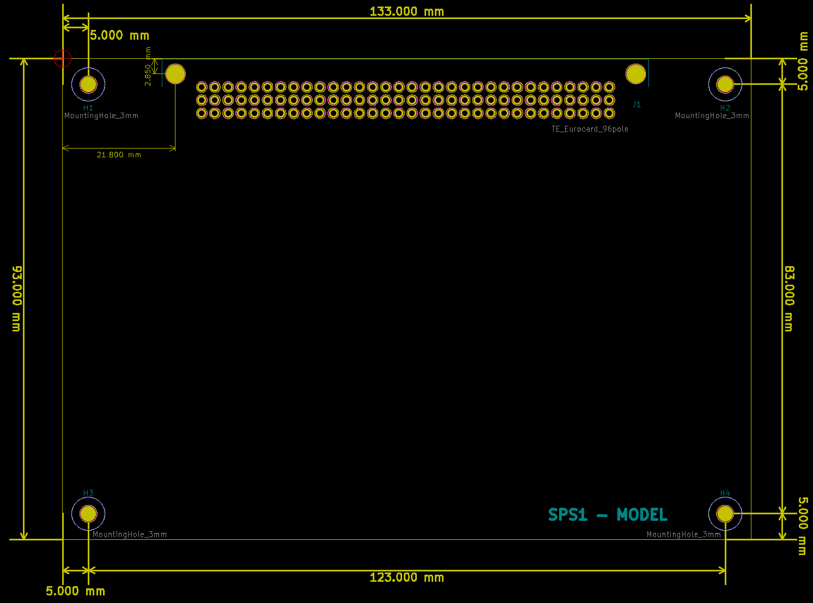
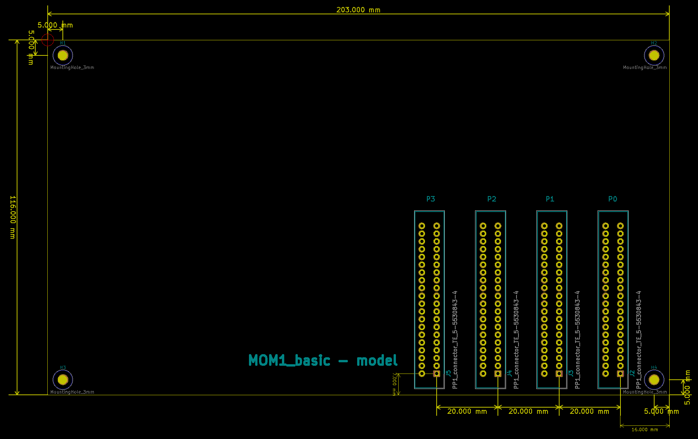
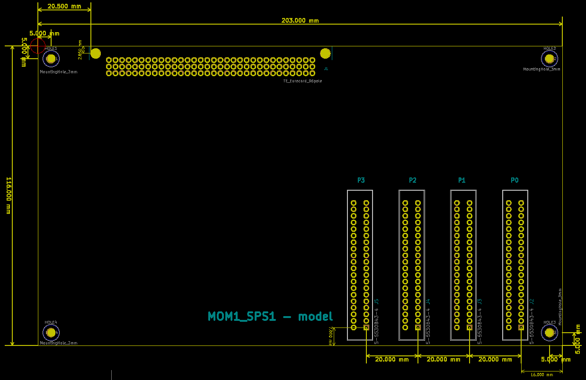

# GComputer_standard
This repository contains all homemade standard essentially for my 8bits computer but can be applied for any other purpose.

Copyright (C) 2019 Guillaume Guillet

# Actual standards

## Processor standards
All processor standards include a mechanical drawing and a simple I/O connection map. 

***"Simple Processor Standard"***

17.01.2020 [SPS1 (revision 1)](SPS1/)\
I/O connection map [here](SPS1/connection.txt)\

## Motherboard standards
All motherboard standards include a basic and supported processor mechanical drawings. 

***"Mother Of Motherboard"***

17.01.2020 [MOM1_basic (revision 1)](MOM1/)\
\
17.01.2020 [MOM1_SPS1 (revision 1)](MOM1/)\

## Memory standards
All memory standards include a reference list of connector and a simple I/O connection map.

*WIP*

## Pheripheral standards
All pheripheral standards include a reference list of connector and a simple I/O connection map.

*WIP*
