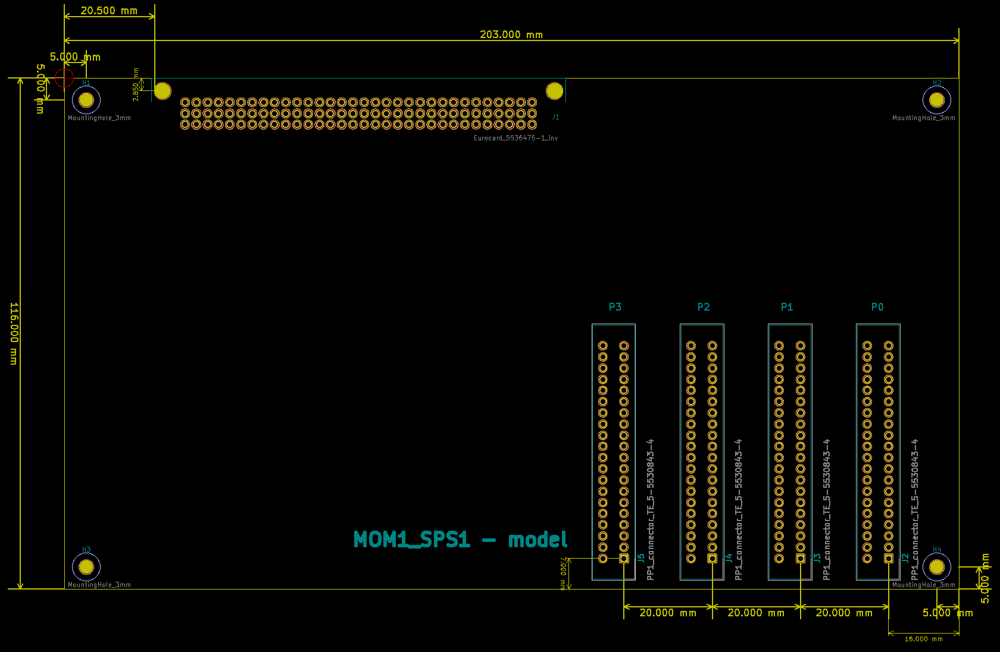

# GComputer_standard
Copyright (C) 2020 Guillaume Guillet

## Description
This repository contains all homemade standard essentially for my 8bits computer but can be applied for any other purpose.

# Actual standards

## Processor standards
All processor standards include a mechanical drawing and a simple I/O connection map. 

***"Simple Processor Standard"***

01.07.2020 [SPS1 (revision 2)](SPS1/)\
I/O connection map [here](SPS1/connection_map.txt)\
Changelog [here](SPS1/CHANGELOG)\

## Motherboard standards
All motherboard standards include a basic and supported processor mechanical drawings. 

***"Mother Of Motherboard"***

17.01.2020 [MOM1_basic (revision 1)](MOM1/)\
\
17.01.2020 [MOM1_SPS1 (revision 1)](MOM1/)\

## Memory standards
All memory standards contain documentation with a description, mechanical detail, electrical detail and pins placement.

***"Memory module"***

13.08.2020 [MM1 (revision 1)](MM1/) , documentation [here](MM1/documentation.txt) , changelog [here](MM1/CHANGELOG)\
 

## Pheripheral standards
All pheripheral standards include a reference list of connector and a simple I/O connection map.

*WIP*

## CodeG standards
CodeG is a homemade binary/simple language to be used in a homemage processor like [GP8B](https://github.com/JonathSpirit/GP8B).

***"CodeG_binary"***\
02.07.2020 [CodeG_binary (revision 1)](CodeG/CodeG_binary_r1/)\
The binary version is what the processor will read and execute.

***"CodeG_simple"***\
02.07.2020 [CodeG_simple (revision 1)](CodeG/CodeG_simple_r1/)\
The simple version allows you to write and read code much more simply but must be compiled to be executed by the processor.
